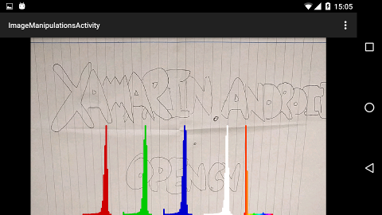
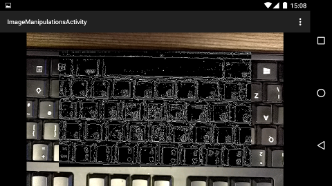
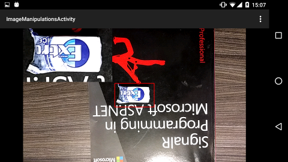
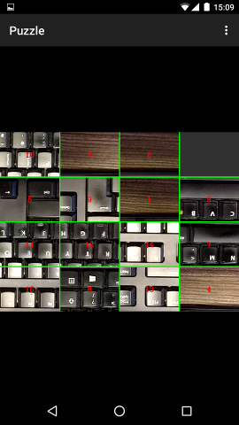

Xamarin.Android.OpenCV v3.1.0
========================

## C# bindings for the OpenCV Android SDK ##

I am not associated with either [OpenCV](http://opencv.org/) or [Xamarin .inc](http://xamarin.com/). All rights belong to their respective owners.

This repository includes a C# translation of the demo applications included with OpenCV4Android.

## Installation ##
1. Clone this repo
2. Build the OpenCV.Binding project
3. Reference "OpenCV.dll" from your project; found under `"Xamarin.Android.OpenCV\src\OpenCV.Binding\bin\[Debug|Release][-$ABI]\OpenCV.dll"`

## Reducing the `.dll` size ##
OpenCV is huge; building the OpenCV binding project for the AnyCPU platform results in a .dll which is ~64MB! If this is too large for your Android application (and it should be) here are some methods to reduce the size:

### 1. Using platform specific build configurations ###
There are platform specific build configurations for each ABI supported by both Xamarin.Android and OpenCV: `arm64-v8a`, `armeabi`, `armeabi-v7a`, `x86` & `x86_64`. Building for one ABI only includes the native libraries for that platform and the Java wrappers. This reduces OpenCV.dll to ~15MB. The down-side of using this method is that it may complicate your final build process if you wish to [support multiple platforms](https://developer.xamarin.com/guides/android/advanced_topics/build-abi-specific-apks/).

### 2. Removing unnecessary native libraries
It's very likely your project won't need *all* the native libraries included in the `OpenCV.Binding\Jars\[Abi]\` folders. You can delete any unnecessary `.so` files, but make sure to test your app *thoroughly*. If you remove a native library file that is later needed your users will get a nasty runtime error! Combining this with the method above we can reduce our `.dll` size to between 5-10MB. Much better.

### 3. Using the `None` configuration ###
If the `None` platform configuration is used no native libraries are bundled in the .dll, only the Java wrappers. The result is a .dll of ~1.5MB. However, now the native libraries must be installed at runtime. This is done using [OpenCVManager](https://play.google.com/store/apps/details?id=org.opencv.engine), a separate application the user installs from the GooglePlay store, which installs the native OpenCV libraries once which every application that uses OpenCV on the device can use. The `OpenCVLoader` class provides a utility method for detecting if the OpenCV libraries are provided by the application, or the OpenCVManager apk.

            if (!OpenCVLoader.InitDebug())
            {
                Log.Debug(TAG,
				"Internal OpenCV library not found. Using OpenCV Manager for initialization");
                OpenCVLoader.InitAsync(OpenCVLoader.OpencvVersion300, this, mLoaderCallback);
            }
            else
            {
                Log.Debug(TAG, "OpenCV library found inside package. Using it!");
                mLoaderCallback.OnManagerConnected(LoaderCallbackInterface.Success);
            }

OpenCV can now be used when `OnManagerConnected(...)` has been called with the `Success` status. See the SDKDemo applications for working examples.

This is the ideal solution if you have many separate applications that use the OpenCV library. To see what the installation process involves, build the SDK demo with the `None` configuration and follow the instructions when starting it up.

## Documentation ##
Documentation is available from [OpenCV](http://docs.opencv.org/2.4/doc/tutorials/introduction/android_binary_package/dev_with_OCV_on_Android.html). As with other Xamarin.Android binding projects, get/set method pairs have been replaced with C# properties and Events have been added to correspond with callback interface methods. Namespaces drop the `org.` prefix and are CamelCased.

## Native application development ##
It is possible to use C/C++ in your mobile OpenCV applications. See the facial recognition and mixed processing examples for how to do this. The C++ code is not compiled in the SDK demo project; it is only included for reference. The C++ code was compiled with eclipse and the ADT/NDK plugins, the resulting `.so` files are then included in this project in the /lib folder.

Cross compiling C++ libraries in the same solution is possible with Visual Studio 2015, see [this  Xamarin blog post for details](https://blog.xamarin.com/build-and-debug-c-libraries-in-xamarin-android-apps-with-visual-studio-2015/).

## Demo App ##
The OpenCV4Android demo apps have been merged into a single application for simplicity

## Contributing ##
Contributions are very welcome, the OpenCV library is huge and any help is appreciated. If you notice an error, either with the Bindings (eg. a missing class) or the SDK demo [please raise an issue](https://github.com/TrekDev/Xamarin.Android.OpenCV/issues).

Alternatively, you can fix it yourself and raise a pull request. Do this by forking the repo and creating a feature branch from `develop`.

## License ##
The Bindings and SDKDemo are provided under the MIT license. See LICENSE for details. OpenCV is provided under the [BSD licence](http://opencv.org/license.html).
